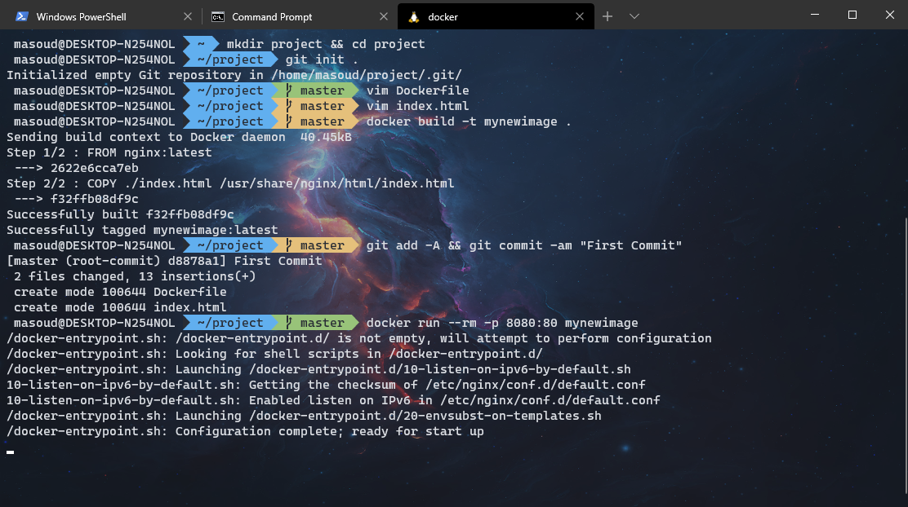

# Setup Docker with Windows Terminal



As you might know, playing with Docker in Windows is quite interesting as it gives you the ability to play with both Linux and Windows containers.
For newcomers to Docker, it may become frustrating to play with the Docker command line because of using Windows Command Prompt or PowerShell as both have not a quite user-friendly terminal and they don't support autocompletion of Docker commands.
I'm giving a brief tutorial to set up Docker to use the new Windows terminal and your favorite Linux distribution to create a nice terminal environment for play with Docker Desktop. I also added the Zsh shell for making it more functional and handy.

## Prerequisites

1. Windows 10 with the latest build 2004.
2. Install WSL2 and a Linux Distribution (I've used Ubuntu 20.04 LTS) You can follow the [official docs](https://docs.microsoft.com/en-us/windows/wsl/install-win10) for installation.  
Don't forget to execute `wsl --set-version <distribution name> 2` to set WSL 2 for your Linux distribution.
3. Install Windows Terminal (Not the preview version) from [Microsoft Store](https://www.microsoft.com/en-us/p/windows-terminal/9n0dx20hk701?activetab=pivot:overviewtab).

## Installation

1. Install Powerline font for Windows along with Cascadia Code monospaced font to support Unicode symbols of Oh my ZSH.
    * Grab the Cascadia Code font from its Github [release page](https://github.com/microsoft/cascadia-code/releases) and install it like regular fonts.

2. Open the Windows Terminal and choose settings. Then it will pop up the `settings.json` file in your default IDE. I recommend you to use VSCode as it gives you the autocompletion of settings parameters. In the `list` section you will see each terminal configuration. We will use the Linux Distro (Ubuntu-20.04 for me) to apply the specific settings. You may also add your custom parameters to the `defaults` section to apply to all existing terminals.

    * Grab your favorite Windows Terminal theme for [here](https://atomcorp.github.io/themes/) and it will copy the json configuration to your clipboard. Then paste it into the `schemes` of the configuration file. Finally add `"colorScheme": "<YourThemeName>"` to the terminal profile section.

    * You can also add your favorite background image to the background of the terminal. Just copy your image (either jpg, png, or gif) to this path `%LOCALAPPDATA%\Packages\Microsoft.WindowsTerminal_8wekyb3d8bbwe\LocalState` then add below settings to the configuration. You can find more info about these parameters in [here](https://docs.microsoft.com/en-us/windows/terminal/customize-settings/profile-settings#background-image-settings).

    ```JSON
        "backgroundImage" : "ms-appdata:///local/<YourImageName>",
        "backgroundImageOpacity" : 0.6,
        "backgroundImageStretchMode" : "fill"
    ```

    * Your final configuration file would looks something like this:

    ```JSON
    {
        "$schema": "https://aka.ms/terminal-profiles-schema",
        "defaultProfile": "{SomeGUID}",
        "copyOnSelect": false,
        "copyFormatting": false,

        "profiles":
        {
            "defaults":
            {
                "cursorShape": "vintage",
                "fontFace": "Cascadia Code PL"
            },
            "list":
            [
                {
                    "guid": "{SomeGUID}",
                    "hidden": false,
                    "name": "Ubuntu-20.04",
                    "source": "Windows.Terminal.Wsl",
                    "backgroundImage" : "ms-appdata:///local/background.jpg",
                    "backgroundImageOpacity" : 0.6,
                    "backgroundImageStretchMode" : "fill",
                    "colorScheme": "3024 Day"
                },
                //...
            ]
        },

        "schemes": [
            {
            "name": "3024 Day",
            "black": "#090300",
            //...
            }
        ],
        //...
    }
    ```

3. Open your Linux distro IDE in Windows Terminal and install Docker as usual. You can follow the [official docs](https://docs.docker.com/engine/install/). During the installation it may ask about installing GRUB you can just skip it. You may see an error after installing Docker, this is because Docker can't run on a separate daemon so open your Docker Desktop settings, navigate to `Resources > WSL INTEGRATION` and enable the integration for your Linux distro.

4. Install Zsh and Oh my Zsh.

    * `sudo apt update && sudo apt install -y git fonts-powerline zsh`
    * `sh -c "$(curl -fsSL https://raw.githubusercontent.com/ohmyzsh/ohmyzsh/master/tools/install.sh)"`
    * After installation, the wizard would ask you to set zsh as your default shell, so accept it.
    * Edit the `~/.zshrc` file and set the proper theme for your zsh.

    ```conf
        ZSH_THEME="agnoster"
    ```

5. Restart the terminal and you should see the new shell applied. Remember that the Docker on your Linux distro will use your Docker host daemon so the data like images, containers, and volumes would save on your host.
